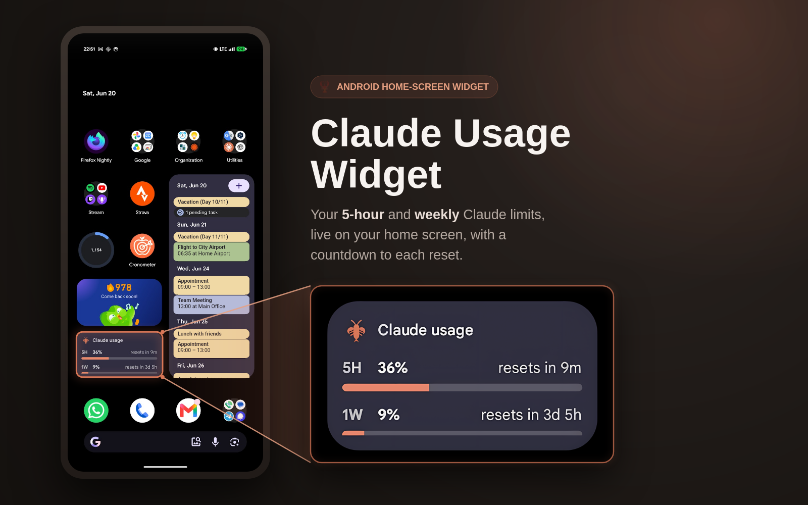

<div align="center">

# 🦞 Claude Usage Widget

**An Android home-screen widget for your Claude subscription usage.**
Keeps your `5H` and `1W` percentages (plus *“resets in”* countdowns) live on your home screen.


<br />



<br />

### [](https://github.com/utaysi/claude-usage-widget/releases/latest/download/claude-usage-widget.apk)

Sign in once on the phone; the widget refreshes itself in the background.

</div>

---

## 📲 Install in 3 steps

1. **[Download the APK](https://github.com/utaysi/claude-usage-widget/releases/latest/download/claude-usage-widget.apk)** on your Android phone (tap the button above).
2. **Open the downloaded file** and tap **Install**.
3. The first time, Android asks to **allow installs from this source** (your browser or file app). Tap **Settings → enable “Allow from this source” → back → Install**. If Play Protect shows an *“unsafe app?”* prompt, that warning appears for any app not installed from the Play Store; choose **Install anyway**.

> Why the warnings? The APK is sideloaded rather than shipped through the Play Store, so Android plays it safe. It's the normal two-tap detour for any direct APK.

Then continue with first-run setup below.

## 👋 First-run setup

1. Open the **Claude Usage** app and tap **Sign in**, then complete the normal `claude.ai` login in the WebView. It closes automatically once it captures your session.
2. Tap **Test fetch now** to confirm it prints your current `5H` and `1W` percentages. These should match `claude.ai/settings/usage`.
3. Tap **Disable battery optimization** and allow it, so Android doesn't kill the 15-minute background refresh.
4. Long-press your home screen → **Widgets** → **Claude Usage**, drag it on, and resize it however you like. Tap it any time to refresh.

## 📋 Requirements

- A Claude **Pro/Max** subscription (this reads consumer subscription usage, not API-key usage).
- **Android 8.0 (API 26)** or newer. Built and tested on a Pixel 9 / Android 16.

---

## ⚠️ Unofficial: use at your own risk

Anthropic provides no public API for subscription (Pro/Max) usage. This widget replays the same **undocumented internal endpoint** that `claude.ai/settings/usage` calls in the browser, authorized by session cookies harvested from an in-app WebView login. It can break at any time if Anthropic changes the endpoint, the auth flow, or its Cloudflare protection. It is not a sanctioned integration, so use it for your own account only.

## ✨ Highlights

- **Two rolling windows at a glance.** The 5-hour and 1-week usage percentages, with a live countdown to each reset.
- **Refreshes itself.** A background job updates every ~15 minutes; tap the widget to force an immediate refresh.
- **Sign in once.** A single `claude.ai` login; you only re-authenticate when the long-lived session finally expires (weeks).
- **Resizes freely.** Snaps between a compact and a full layout, and adapts to light & dark themes.

## 🛠 How it works

You log in once through a real `claude.ai` WebView. The app harvests the `sessionKey` and `cf_clearance` cookies plus the WebView User-Agent, stores them encrypted on-device, and fetches usage headlessly with `OkHttp`. When a headless fetch hits Cloudflare's challenge, the app silently re-solves it in an off-screen WebView (no interaction needed while `sessionKey` is valid) and retries. A `WorkManager` job refreshes every ~15 minutes. You only sign in again when the long-lived `sessionKey` itself expires, at which point the widget shows a *“Tap to sign in”* state.

The widget snaps between a **Compact** layout (mascot + two mini bars + percentages) and a **Full** layout (mascot + label + two bars with percentage and *“resets in”* for each). Both adapt to light and dark themes, and a small amber dot appears when the numbers are stale.

## 🔒 Security notes

Credentials (`sessionKey`, `cf_clearance`, User-Agent, org ID) are stored in `EncryptedSharedPreferences` backed by the Android Keystore, and `android:allowBackup="false"` keeps them out of cloud backups. The `sessionKey` is as sensitive as your account password (anyone who extracts it can act as you), so treat a rooted or compromised device accordingly. No secrets are stored in the repo or baked into the APK.

---

<details>
<summary><b>🧰 Build from source</b></summary>

<br />

You only need this if you want to build the APK yourself instead of downloading it.

**Requirements:** JDK 17, the Android SDK with platform 36, and the bundled Gradle wrapper.

**1. Point Gradle at your Android SDK** by creating `local.properties` in the project root (gitignored):

```properties
sdk.dir=/path/to/your/Android/Sdk
```

**2. Build the debug APK:**

```bash
./gradlew :app:assembleDebug
```

**3. Install it.** The APK lands at `app/build/outputs/apk/debug/app-debug.apk`. Enable USB debugging (Settings → System → Developer options → USB debugging), plug in the phone, and run:

```bash
adb install -r app/build/outputs/apk/debug/app-debug.apk
```

Or copy that APK to the phone and tap it to sideload it directly.

**Project layout:**

| Path | What lives there |
| --- | --- |
| `app/.../data` | Endpoint constants, encrypted storage, cookie harvesting, the Cloudflare resolver, and the repository that orchestrates fetch, Cloudflare retry, and auth-state transitions. |
| `auth/LoginActivity.kt` | The WebView login. |
| `ui/MainActivity.kt` | The setup / debug screen. |
| `widget/` | The Glance widget and its layouts. |
| `work/` | Background refresh scheduling. |

</details>
